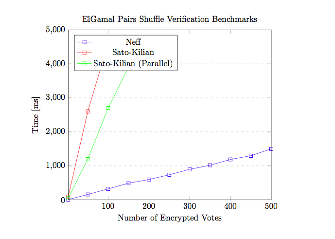

# ElGamal Pairs Shuffle Verification Benchmarks

This proof-of-concept shows the performance improvements gained by using
Neff shuffles [1, 5] over Sako-Kilian mixnets [2]. The application encrypts an adjustable
number of messages (votes) and shuffles them before producing a non-interactive
sigma protocol proof of the shuffle.

The code is heavily based on the DEDIS Kyber Advanced Crypto Library. [4]
The Sako-Kilian mixnet has been borrowed from the Helios project. [3, 6]



## Installation

```
git clone https://github.com/qantik/evo
cd evo/backend
go get ./...
go run main.go
```

## References

[1] **Verifiable Mixing (Shuffling) of ElGamal Pairs**; *C. Andrew Neff*, 2004\
[2] **Receipt-Free Mix-Type Voting Scheme**; *Kazue Sako, Joe Kilian*, 1998\
[3] **Helios: Web-based Open-Audit Voting**; *Ben Adida*, 2008\
[4] **DEDIS Kyber**, https://github.com/dedis/kyber \
[5] **DEDIS Kyber Neff Shuffles**, https://github.com/dedis/kyber/tree/master/shuffle \
[6] **Helios**, https://github.com/benadida/helios-server
